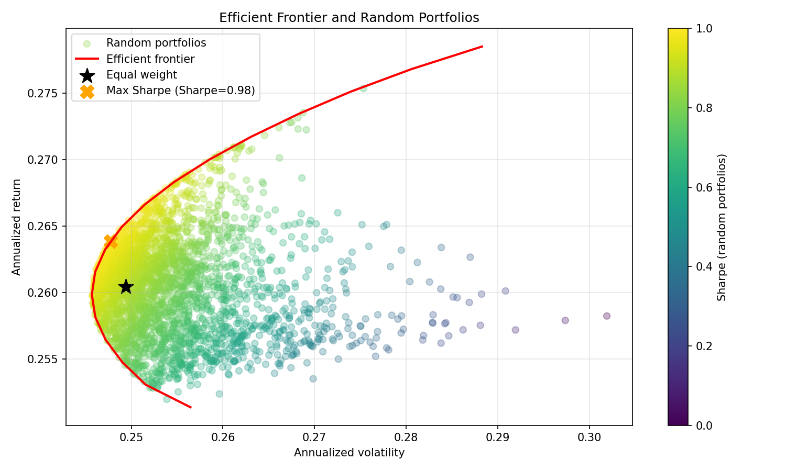
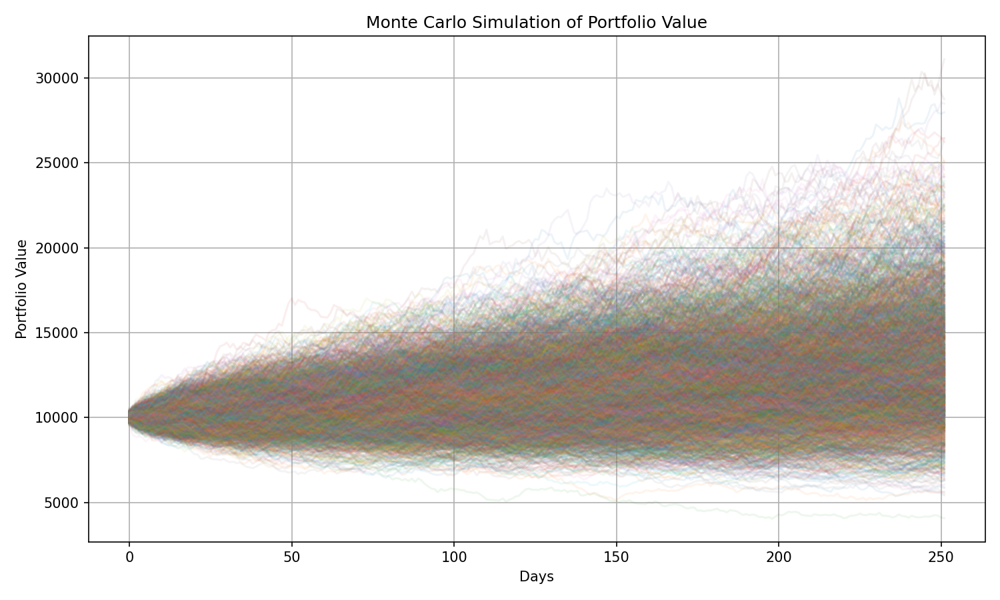
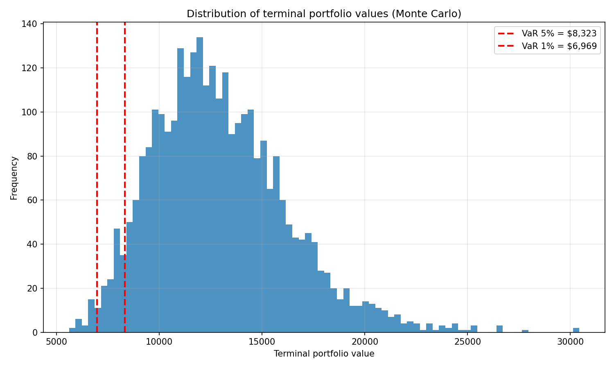

# BlackScholes-Finance-Project

A Python portfolio analytics project that combines market data ingestion, portfolio risk/return analysis, efficient frontier optimization, Monte Carlo simulation, and Value-at-Risk (VaR) estimation.

## What it does

- Downloads historical price data from Yahoo Finance
- Cleans MultiIndex / flat DataFrame outputs robustly
- Calculates daily returns, annualized return, volatility, and Sharpe ratio
- Builds an efficient frontier using constrained optimization
- Runs Monte Carlo portfolio simulations
- Estimates VaR and CVaR from simulated terminal portfolio values
- Saves visual outputs as PNG files for portfolio presentation

## Main outputs

- `efficient_frontier.png`
- `monte_carlo.png`
- `terminal_dist.png`
- `var_summary.json`

## Files

- `stock_analysis.py` — main analysis script
- `requirements.txt` — Python dependencies
- `efficient_frontier.png` — efficient frontier chart
- `terminal_dist.png` — terminal value distribution with VaR lines
- `var_summary.json` — VaR / CVaR summary

## Technologies used

- Python
- pandas
- numpy
- yfinance
- scipy
- matplotlib

## How to run

```bash
pip install -r requirements.txt
python stock_analysis.py

## Visual Results

### Efficient Frontier


### Monte Carlo Simulation


### Terminal Distribution with VaR
